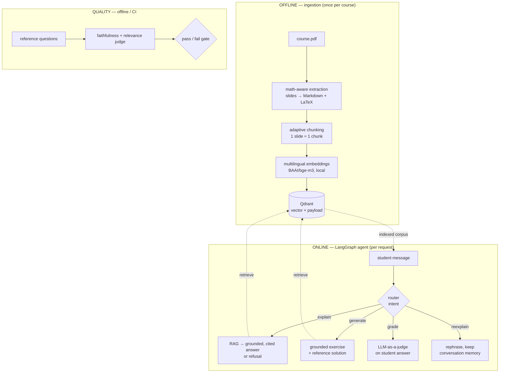

# grounded-rag


**An AI tutor that answers strictly from your own course material, always citing the source, and refuses anything it does not cover.**

`grounded-rag` indexes your courses once (slides, exercise sets, summaries) into a persistent vector
store, then answers questions using *only* those documents. Every claim is backed by a citation
(course, chapter, page), and when nothing in the material is relevant enough, the system says so
instead of guessing. The running use case is a study assistant over university courses, but the
pipeline is document-agnostic.

## Why it beats a generic chatbot for studying

| Generic chatbot | grounded-rag |
| --- | --- |
| Documents are lost between conversations | **Persistent indexed knowledge base** (Qdrant), courses indexed once |
| Drifts to out-of-source methods and content | **Strict grounding** behind a calibrated **similarity threshold**: irrelevant retrieval becomes an explicit refusal |
| References cannot be verified | **Systematic citations** (course / chapter / page) on every answer |
| Can hallucinate confidently | **Faithfulness guard**: an offline judge checks that answers are supported by the retrieved sources |

Citations are produced **by construction**, not on trust. The model only ever sees numbered sources
`[1] [2] [3]` and is instructed to cite those indices; the code then remaps each `[n]` to its real
source label. The model never handles page numbers, so it cannot invent one.

## Architecture

The system splits into an **offline** ingestion pass (run once per course) and an **online** agent
that serves requests, plus an offline **quality / evaluation** layer.



<details>
<summary>Text version of the diagram</summary>

```
OFFLINE — ingestion (once per course)
  PDF
   -> math-aware extraction        (slides -> Markdown + LaTeX preserved)
   -> adaptive chunking            (one slide ≈ one chunk; prose split with overlap)
   -> multilingual embeddings      (BAAI/bge-m3, local)
   -> Qdrant upsert                ({vector, payload: course/chapter/page/text})

ONLINE — agent (per request)
              ┌─ explain     RAG -> grounded, cited answer (or refusal)
   router ────┼─ generate    grounded exercise + reference solution
   (intent)   ├─ grade       LLM-as-a-judge on the student's answer
              └─ reexplain   rephrase, keeping conversation memory

QUALITY — offline / CI
  reference questions -> answer -> faithfulness + relevance judge -> pass/fail gate
```

</details>

A deeper, module-level walkthrough lives in [`docs/ARCHITECTURE.md`](docs/ARCHITECTURE.md).

**Math-aware extraction.** Pages are rasterized and transcribed by a vision model into Markdown with
LaTeX kept inline, so formulas survive ingestion. A `--hybrid` flag routes plain-text pages to fast,
free PyMuPDF extraction and reserves the vision path for math- and figure-heavy pages. Transcriptions
run concurrently (`--concurrency`), and `--pages` / `--max-pages` allow targeting a subset.

**Adaptive chunking.** Chunking follows the document type: slide decks map roughly one slide to one
chunk (so unrelated slides are not glued together), while prose is split into overlapping windows.

**Retrieval with refusal.** A question is embedded with the same model used at indexing time, and the
top-k chunks are fetched from Qdrant with a `score_threshold`. If nothing clears the threshold, the
answer layer returns an explicit refusal rather than answering from the model's own knowledge. The
threshold is calibrated empirically (in-course questions accepted, out-of-course questions rejected).
An **opt-in hybrid dense + sparse (BM25-style) path** (`HYBRID_RETRIEVAL=1`, with a `--sparse` re-ingest)
fuses a dense kNN branch and a `bge-m3` lexical branch with Reciprocal Rank Fusion via Qdrant's Query API;
the dense branch keeps the same threshold, so grounding and refusal are preserved. It engages only when
the collection actually carries the sparse vector, and otherwise falls back to dense retrieval.

**Streaming.** Alongside `POST /ask`, `POST /ask/stream` returns a `text/event-stream`: token deltas
arrive first and the explanation renders as it is produced, followed by a single final event carrying
the remapped sources and the refusal flag. Citation remapping is applied once, to the fully assembled
text, so streamed `[n]` markers can never leak an invented page.

**Quiz mode.** `POST /quiz` generates a grounded multi-question quiz on a notion (reference solutions
stay server-side, never returned), and `POST /quiz/{quiz_id}/grade` marks one answer against its stored
reference solution. Both are grounded in retrieval, so a notion the course does not cover yields a refusal.

**Agent.** A LangGraph router classifies the intent (`explain` / `generate` / `grade` / `reexplain`)
and dispatches to the matching node, with a deterministic keyword fallback if the model output is
unusable. `generate` is itself grounded in retrieval so exercises stay calibrated to the course's own
notation.

**Quality layer.** An offline judge (distinct from the product-side grading node) checks answers for
**faithfulness** (every claim supported by the retrieved sources, no outside knowledge) and
**relevance**, plus **refusal accuracy** on questions that should be rejected. It runs from a
reference dataset and exits non-zero on regression, so it can gate CI.

**Observability.** Every LLM call goes through one factory, so **LangFuse tracing** (per-step latency,
tokens, cost) is a drop-in: it activates only when LangFuse credentials are present and is zero-cost
when off — see [docs/OBSERVABILITY.md](docs/OBSERVABILITY.md).

## Tech stack

`Python` · `LangChain` / `LangGraph` · `FastAPI` · `Qdrant` · `Docker` · `GitHub Actions`

- **Embeddings:** local multilingual `BAAI/bge-m3` (documents and questions are in French) — free, no API call.
- **PDF extraction:** PyMuPDF for plain-text pages; a vision model for math/figure pages.
- **Model-agnostic LLM factory:** `get_llm(role)` selects a model per role from `LLM_<ROLE>` env vars,
  defaulting to a small OpenAI chat model. Swapping models (small router, larger generator/grader) is
  an environment change, not a code change.
- **Fully local / zero-cost option:** set `LLM_PROVIDER=ollama` (or `LLM_<ROLE>=ollama:<model>`) to run
  every LLM on a local [Ollama](https://ollama.com) server. Embeddings, reranker, and Qdrant are already
  local, so the whole pipeline then costs nothing and runs offline — see [docs/LOCAL.md](docs/LOCAL.md).
- **Packaging:** `uv` (lockfile, no `requirements.txt`). **Lint/format:** `ruff`.

## Quickstart

Requires Python 3.12+, [`uv`](https://docs.astral.sh/uv/), and Docker.

```bash
# 1. Install dependencies (extras are installed per phase)
uv sync --extra ingestion --extra agent

# 2. Start the vector database
docker compose up -d qdrant

# 3. Configure the environment
cp .env.example .env        # then set OPENAI_API_KEY

# 4. Ingest a course PDF (vision extraction; --hybrid for cheaper text pages)
uv run python -m ingestion.run path/to/course.pdf --course "Wavelet Transform" --hybrid

# 5. Ask a grounded, cited question from the CLI
uv run python -m core.ask "What is a piecewise constant approximation?"

# 6. (Optional) run the offline faithfulness/relevance evaluation
uv run python -m eval.run_eval
```

### Service interface (API)

The same capabilities are exposed as an HTTP service (FastAPI):

| Endpoint | Role |
| --- | --- |
| `POST /ask` | ask a question, grounded and cited |
| `POST /ask/stream` | same answer, streamed token by token as Server-Sent Events |
| `POST /reexplain` | rephrase the last answer at a chosen level (beginner / intermediate / advanced) |
| `POST /exercise` | generate an exercise (never returns the reference solution) |
| `POST /grade` | grade a student's answer |
| `POST /quiz` | generate a grounded multi-question quiz on a notion |
| `POST /quiz/{quiz_id}/grade` | grade one quiz answer against its stored reference solution |
| `GET /history/{student_id}` | recent conversation turns, chronological |
| `GET /health` | health check |

Run it with:

```bash
uv run uvicorn api.main:app --reload
```

## Example

A grounded answer cites only the sources it relies on:

```
$ uv run python -m core.ask "What is a piecewise constant approximation?"

A piecewise constant approximation represents a signal as a sum of scaled,
shifted box functions that are constant on each dyadic interval, capturing the
signal's average over that interval (Wavelet Transform, Chap. 2, p.11).

Sources:
  - (Wavelet Transform, Chap. 2, p.11)
```

A question the course does not cover is refused, not answered:

```
$ uv run python -m core.ask "How do I set up a Kubernetes cluster?"

This is not covered in the course material.
```

## Metrics

Measured end-to-end on a full course: a 63-slide *Wavelet Transform* deck ingested into Qdrant,
then evaluated with the offline harness (`eval/run_eval.py`) and the threshold calibration script.

| Metric | Result | Notes |
| --- | --- | --- |
| **Index** | 63 / 63 slides | Parallel ingestion absorbed 25 rate-limit (HTTP 429) responses via retry + backoff, zero crashes |
| **Threshold calibration** | **100% in/out accuracy** | In-course scores 0.57–0.68, out-of-course 0.28–0.43 → clean separation; threshold calibrated to ≈ 0.50 (0.497) |
| **Retrieval hit-rate** | **73% → 82% (+9 pts)** | With the cross-encoder reranker (`cross-encoder/ms-marco-MiniLM-L-6-v2`) enabled |
| **Hybrid retrieval (dense + BM25)** | **+9.1 pts hit-rate · +6.6 NDCG@5** | RRF fusion of dense + `bge-m3` sparse vs dense-only, 22 in-course questions (hit-rate 63.6% → 72.7%; MRR +6.8). Measured on a locally re-extracted sparse index, so the dense→hybrid *delta* is what's comparable. |
| **Faithfulness** | **75%** | Offline LLM-as-a-judge (gpt-4o-mini): every claim supported by the retrieved sources |
| **Relevance** | **100%** | Same judge: answers actually address the question |
| **Retrieval latency** | **p50 67 ms · p95 466 ms** | Query embedding (`bge-m3`) + Qdrant search over 36 questions; LLM-independent, so it holds across providers. End-to-end answer latency is dominated by the chosen LLM. |

**Honest caveat.** This deck is *constructive* (formula slides, few prose definitions), so some
definitional in-course questions are **refused rather than answered**: the system declines instead of
hallucinating. That is the North-Star guard working as intended — it lowers the raw "refusal accuracy"
number on borderline definitional questions, but the alternative (inventing a definition the slides
never state) is exactly what `grounded-rag` is built to avoid.

## Demo


*Asking an in-course question (grounded, cited answer) then an out-of-course one (honest refusal),
generating an exercise, and grading a student answer — all from the Streamlit tutor UI.*

The full click-by-click recording script is in [`docs/DEMO.md`](docs/DEMO.md).

### Try it locally

Docker runs only the vector store; the API and UI run on the host (this keeps the image free of the
heavy ML runtime — `torch` / CUDA wheels are multi-gigabyte).

```bash
docker compose up -d qdrant   # 1. start the vector store (course already indexed)
make api                      # 2. FastAPI on http://localhost:8000
make ui                       # 3. Streamlit UI on http://localhost:8501
```

- **Streamlit UI** — <http://localhost:8501> (tabs: Ask · Exercise · Grade · History; *re-explain by
  level* is a control under the Ask tab)
- **API docs** — <http://localhost:8000/docs>

Do **not** run `docker compose down` while demoing — it stops Qdrant.

A known-good in-course question, *"What is the piecewise constant approximation?"*, returns a cited
answer with LaTeX preserved. An out-of-course question is refused with
`This is not covered in the course material.` rather than answered.

## Documentation

| Guide | Topic |
| --- | --- |
| [docs/ARCHITECTURE.md](docs/ARCHITECTURE.md) | module-level walkthrough of the whole system |
| [docs/LOCAL.md](docs/LOCAL.md) | run fully local / zero-cost with Ollama |
| [docs/OBSERVABILITY.md](docs/OBSERVABILITY.md) | opt-in LangFuse tracing |
| [docs/DEPLOY-API.md](docs/DEPLOY-API.md) | the CPU-only Docker image for the API service |
| [docs/DEPLOY.md](docs/DEPLOY.md) | free-tier live deployment (Vercel + Hugging Face Spaces + Qdrant Cloud) |
| [docs/DEMO.md](docs/DEMO.md) | demo recording script for the GIF above |

## Notes

- `.env`, secrets, and course PDFs are never committed (personal data).
- Author: `mathisdelsart`.
